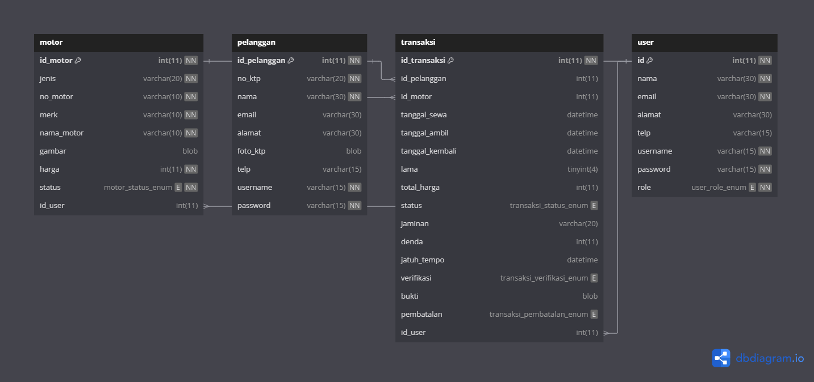

# Rancangan Database

# Rancangan Input/Output

## 1. Rancangan Input/Output untuk Pengguna (Pelanggan)

### a. Registrasi dan Login
- **Input:**
  - Nama
  - Nomor KTP
  - Email
  - Alamat
  - Nomor Telepon
  - Foto KTP (upload)
  - Username
  - Password
- **Output:**
  - Notifikasi berhasil atau gagal registrasi.
  - Halaman login jika registrasi berhasil.
  - Notifikasi login berhasil atau pesan kesalahan jika login gagal.

### b. Pencarian dan Pemilihan Motor
- **Input:**
  - Kriteria pencarian (jenis motor, merk, harga, status ketersediaan)
  - Pilihan motor untuk disewa
- **Output:**
  - Daftar motor yang sesuai dengan kriteria pencarian.
  - Detail motor yang dipilih (nama motor, merk, harga, status, dan gambar).

### c. Transaksi Penyewaan
- **Input:**
  - Tanggal sewa
  - Tanggal pengembalian
  - Lama sewa (dihitung otomatis berdasarkan tanggal)
  - Total harga (dihitung otomatis berdasarkan lama sewa dan harga per hari)
  - Jaminan (misalnya, nomor identitas atau detail tambahan yang diperlukan)
  - Pilihan pembayaran (metode pembayaran)
  - Upload bukti pembayaran
- **Output:**
  - Ringkasan transaksi yang menampilkan detail motor, lama sewa, total harga, dan status pembayaran.
  - Notifikasi berhasil atau gagal melakukan transaksi.
  - Konfirmasi pemesanan beserta kode transaksi.

### d. Riwayat Transaksi
- **Input:**
  - Tidak ada input langsung, cukup akses menu riwayat transaksi.
- **Output:**
  - Daftar riwayat transaksi sebelumnya, termasuk detail transaksi (motor, tanggal sewa, tanggal kembali, total harga, dan status).
  - Detail transaksi ketika salah satu riwayat dipilih.

### e. Konfirmasi dan Pembatalan
- **Input:**
  - Kode transaksi
  - Tindakan yang diinginkan (konfirmasi atau pembatalan)
- **Output:**
  - Notifikasi konfirmasi berhasil atau pembatalan berhasil.
  - Status transaksi diperbarui di riwayat transaksi.

## 2. Rancangan Input/Output untuk Admin (Pemilik/Admin)

### a. Manajemen Pengguna
- **Input:**
  - Data pengguna yang ingin dilihat atau dikelola (misalnya, nama pengguna atau ID pengguna)
  - Tindakan (aktivasi, deaktivasi, hapus)
- **Output:**
  - Daftar pengguna terdaftar beserta status akun mereka.
  - Notifikasi berhasil atau gagal dalam mengelola akun pengguna.

### b. Manajemen Motor
- **Input:**
  - Data motor baru untuk ditambahkan (jenis, merk, nama motor, harga, status, gambar)
  - Data motor yang ingin diubah atau dihapus
- **Output:**
  - Daftar motor yang tersedia beserta detailnya.
  - Notifikasi berhasil atau gagal dalam penambahan, pengeditan, atau penghapusan motor.
  - Tampilan detail motor setelah perubahan disimpan.

### c. Manajemen Transaksi
- **Input:**
  - Kode transaksi atau ID transaksi untuk transaksi tertentu yang ingin dikelola
  - Tindakan pada transaksi (verifikasi, pembatalan, dll.)
- **Output:**
  - Daftar transaksi, lengkap dengan status, tanggal, pelanggan, dan detail motor.
  - Notifikasi perubahan status transaksi (misalnya, berhasil diverifikasi atau dibatalkan).
  - Ringkasan transaksi setelah status diperbarui.

### d. Laporan dan Statistik
- **Input:**
  - Periode waktu untuk laporan (misalnya, bulan atau tahun)
  - Kategori laporan (misalnya, laporan transaksi, laporan pendapatan)
- **Output:**
  - Tampilan laporan dalam bentuk tabel atau grafik, yang mencakup data transaksi, pendapatan, motor yang paling banyak disewa, dll.
  - Opsi untuk mengunduh laporan dalam format PDF atau Excel.

### e. Verifikasi Pembayaran
- **Input:**
  - Kode transaksi atau ID transaksi untuk transaksi yang perlu diverifikasi
  - Bukti pembayaran yang diunggah pelanggan
- **Output:**
  - Tampilan bukti pembayaran untuk diverifikasi.
  - Status transaksi diperbarui menjadi "terverifikasi" setelah admin melakukan verifikasi.
  - Notifikasi berhasil atau gagal dalam verifikasi.

# Rancangan Input/Output 

| **Fitur**                             | **Input**                                                                                     | **Output**                                                                                     |
|---------------------------------------|-----------------------------------------------------------------------------------------------|-----------------------------------------------------------------------------------------------|
| **Registrasi**                        | Nama, KTP, Email, Alamat, Telepon, Foto KTP, Username, Password                              | Notifikasi registrasi berhasil/gagal, halaman login                                           |
| **Login**                             | Username, Password                                                                            | Notifikasi login berhasil/gagal, akses ke halaman utama                                      |
| **Pencarian Motor**                  | Jenis, merk, harga, status                                                                   | Daftar motor yang sesuai kriteria                                                              |
| **Transaksi Penyewaan**               | Tanggal sewa, tanggal kembali, jaminan, metode pembayaran, bukti pembayaran                  | Ringkasan transaksi, notifikasi berhasil/gagal, kode transaksi                                 |
| **Riwayat Transaksi**                 | Tidak ada                                                                                     | Daftar riwayat transaksi, detail transaksi                                                    |
| **Manajemen Pengguna (Admin)**       | Data pengguna, tindakan (aktivasi, deaktivasi, hapus)                                       | Daftar pengguna, notifikasi berhasil/gagal                                                    |
| **Manajemen Motor (Admin)**          | Data motor baru, tindakan (edit, hapus)                                                     | Daftar motor, notifikasi berhasil/gagal                                                       |
| **Manajemen Transaksi (Admin)**      | Kode transaksi, tindakan (verifikasi, pembatalan)                                           | Daftar transaksi, notifikasi perubahan status                                                 |
| **Laporan dan Statistik (Admin)**    | Periode waktu, kategori laporan                                                               | Laporan transaksi/pendapatan dalam bentuk tabel atau grafik, opsi unduh                      |
| **Verifikasi Pembayaran**             | Kode transaksi, bukti pembayaran                                                              | Tampilan bukti pembayaran, notifikasi berhasil/gagal, status transaksi terverifikasi          |
